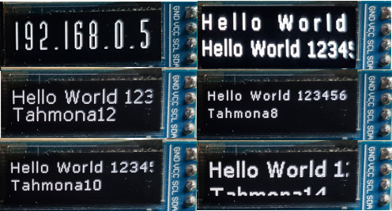

# Simple C# text display driver for the SSD1306.



- Simple to use
- Includes Fonts, Tahmona 8 - 14 and DinerRegular24
- Built in Linux I2C driver
- Optional Proportional spacing
- Availabe as Nuget package
- Meadow Support

### Example

```
    using (var i2cBus = new I2CBus("/dev/i2c-1"))
    {
        var i2cDevice = new I2CDevice(i2cBus, Display.DefaultI2CAddress);
    
        display = new SSD1306.Display(i2cDevice,128,32);
        display.Init();
    
        var dfont = new Tahmona12();
    
        display.WriteLineBuff(dfont,"Hello World 123456","Line 2 xxxx");
        display.DisplayUpdate();
    }
```
### Proportional spacing.
```
    var dinerRegular24 = new DinerRegular24();
    display.WriteLineBuffProportional(dinerRegular24,"192.168.0.5");                
    display.DisplayUpdate();
```

### Meadow Support.
```

    II2cBus i2cBus = Device.CreateI2cBus();
    II2cPeripheral i2cPeripheral = new I2cPeripheral(i2cBus, Display.DefaultI2CAddress);
    var i2cDevice = new SSD1306Display(i2cPeripheral);
    var display = new SSD1306.Display(i2cDevice, 128, 32,true);
    display.Init();
    var dfont = new DinerRegular24();
        
    display.WriteLineBuffProportional(dfont, "IOT-SAS.tech");
    display.DisplayUpdate();


    class SSD1306Display : SSD1306.I2C.II2CDevice
    {
        public II2cPeripheral I2cPeripheral { get; private set; }

      
        public SSD1306Display(II2cPeripheral I2cPeripheral)
        {
            this.I2cPeripheral = I2cPeripheral;
        }

        public void WriteBytes(byte regAddress, byte[] data)
        {
            I2cPeripheral.WriteRegisters(regAddress, data);
        }

        public void WriteByte(byte regAddress, byte data)
        {
            I2cPeripheral.WriteRegister(regAddress, data);
        }

    }
    
```